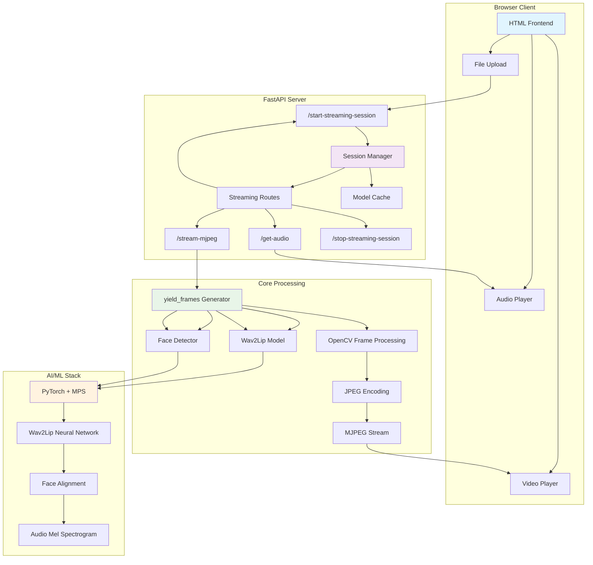

# FACE-ANIMATION: Real-Time Lip-Sync Video Generation & Streaming

A high-performance lip-sync video generation system built with **FastAPI** and **gRPC** that transforms audio input into realistic lip-synced videos using the Wav2Lip model. Features **real-time MJPEG streaming** for browser-based applications, optimized for **macOS M1/M2** with Metal Performance Shaders (MPS) support and designed for real-time applications with **<300ms latency**.

## 🚀 Key Features

- **🎥 Real-Time MJPEG Streaming**: Browser-compatible video streaming via `multipart/x-mixed-replace`
- **🌐 Modern Web Interface**: Beautiful HTML frontend with drag-and-drop audio upload
- **⚡ Ultra-Low Latency**: <300ms processing time with adaptive frame rate control
- **📱 Browser-Native Playback**: Direct `<video>` and `<audio>` tag support
- **Dual API Architecture**: REST (FastAPI) + Streaming (gRPC) + Real-time MJPEG
- **Direct Audio Input**: Process WAV, MP3, M4A, AAC files without text-to-speech
- **M1/M2 Optimization**: Native MPS support for Apple Silicon GPUs
- **Session Management**: Reusable model instances for optimal performance
- **Parallel Processing**: Concurrent audio and image preprocessing
- **Performance Monitoring**: Real-time latency tracking and detailed metrics
- **Avatar Management**: Upload and manage multiple avatar images

## 🏗️ Technical Architecture



## 📁 Project Structure

```
FACE-ANIMATION/
├── 🌐 API Servers & Streaming
│   ├── main.py                    # FastAPI HTTP server with MJPEG streaming
│   ├── grpc_server.py             # gRPC streaming server implementation
│   └── serve_grpc.py              # gRPC server launcher
├── 🎬 Core Processing & Streaming
│   ├── lip_sync.py                # Main lip-sync engine + yield_frames generator
│   └── upload_avatar.py           # Avatar management system
├── 📡 Protocol Definitions
│   ├── avatar.proto               # Protocol buffer service definitions
│   ├── avatar_pb2.py              # Generated protobuf messages
│   └── avatar_pb2_grpc.py         # Generated gRPC service stubs
├── 🧪 Testing & Examples
│   └── grpc_client_test.py        # gRPC client for testing and examples
├── 🤖 AI Models
│   ├── Wav2Lip/                   # Wav2Lip model directory
│   │   ├── models/                # Neural network architectures
│   │   ├── face_detection/        # Face detection models
│   │   ├── checkpoints/           # Pre-trained model weights
│   │   └── audio.py               # Audio processing utilities
│   └── Wav2Lip.zip                # Wav2Lip model archive
├── 📂 Data Directories
│   ├── output/                    # Generated video outputs
│   ├── temp/                      # Temporary processing files
│   └── main_avatar.png            # Default avatar image
├── ⚙️ Configuration
│   ├── requirements.txt           # Python dependencies
│   └── README.md                  # Project documentation
└── 🔧 Environment
    └── venv/                      # Virtual environment
```

## 🛠 Technology Stack

### Core Framework
- **[FastAPI](https://fastapi.tiangolo.com/)** - Modern async web framework with streaming
- **[gRPC](https://grpc.io/)** - High-performance streaming RPC
- **[Protocol Buffers](https://protobuf.dev/)** - Efficient serialization
- **MJPEG Streaming** - Browser-compatible video streaming

### AI/ML Stack
- **[PyTorch](https://pytorch.org/)** - Deep learning framework with MPS support
- **[Wav2Lip](https://github.com/Rudrabha/Wav2Lip)** - State-of-the-art lip synchronization
- **[Face Alignment](https://github.com/1adrianb/face-alignment)** - Robust face detection

### Audio/Video Processing
- **[librosa](https://librosa.org/)** - Advanced audio analysis
- **[OpenCV](https://opencv.org/)** - Computer vision and real-time frame processing
- **[FFmpeg](https://ffmpeg.org/)** - Video encoding and format conversion

### Performance Optimizations
- **Metal Performance Shaders (MPS)** - Apple Silicon GPU acceleration
- **ThreadPoolExecutor** - Parallel processing
- **AsyncIO** - Asynchronous I/O operations
- **Non-blocking Tensor Operations** - Ultra-low latency processing
- **Adaptive Frame Rate Control** - Real-time streaming optimization

## 🚀 Quick Start

### Prerequisites

- **macOS** (recommended for M1/M2 optimization) or Linux
- **Python 3.8+**
- **FFmpeg** installed and accessible in PATH
- **Modern web browser** (Chrome, Firefox, Safari, Edge)

### Installation

1. **Clone and setup environment:**
```bash
git clone <repository-url>
cd FACE-ANIMATION
python3 -m venv venv
source venv/bin/activate  # macOS/Linux
# venv\Scripts\activate   # Windows
```

2. **Install dependencies:**
```bash
pip install -r requirements.txt
```

3. **Install FFmpeg:**
```bash
# macOS with Homebrew
brew install ffmpeg

# Ubuntu/Debian
sudo apt update && sudo apt install ffmpeg

# Windows - Download from https://ffmpeg.org/
```

4. **Verify installation:**
```bash
python -c "import torch; print(f'PyTorch: {torch.__version__}')"
python -c "import torch; print(f'MPS Available: {torch.backends.mps.is_available()}')"
ffmpeg -version | head -1
```

## 🎯 Usage Examples

### 1. 🎥 Real-Time MJPEG Streaming (Recommended)

**Start the server:**
```bash
python main.py
```

**Access the web interface:**
1. Open browser to `http://localhost:8000`
2. Upload an audio file (WAV, MP3, M4A, AAC)
3. Click "Start Streaming Session"
4. Watch real-time lip-synced video stream!

**Features:**
- ✅ Real-time video streaming via MJPEG
- ✅ Synchronized audio playback
- ✅ <300ms latency optimized
- ✅ Browser-native `<video>` and `<audio>` tags
- ✅ Beautiful responsive UI
- ✅ Session management

### 2. HTTP REST API (FastAPI)

**API available at:** `http://localhost:8000/api-info`
**Interactive docs:** `http://localhost:8000/docs`

**Generate lip-sync video via cURL:**
```bash
curl -X POST "http://localhost:8000/generate-lip-sync-video" \
     -F "audio_file=@your_audio.wav" \
     -H "accept: application/json"
```

**Real-time streaming API:**
```bash
# Start streaming session
curl -X POST "http://localhost:8000/start-streaming-session" \
     -F "audio_file=@your_audio.wav"

# Access video stream
curl "http://localhost:8000/stream-mjpeg"

# Access audio stream  
curl "http://localhost:8000/get-audio"

# Stop session
curl -X DELETE "http://localhost:8000/stop-streaming-session"
```

### 3. gRPC Streaming API

**Start the gRPC server:**
```bash
python serve_grpc.py
```

**Test with the gRPC client:**
```bash
python grpc_client_test.py --audio path/to/audio.wav --session_id test_session
```

### 4. Direct Python Integration

```python
from lip_sync import generate_lip_sync_video, get_session_manager, yield_frames

# Traditional video generation
video_path = generate_lip_sync_video(
    image_path="main_avatar.png",
    audio_path="audio.wav"
)
print(f"Generated video: {video_path}")

# Real-time frame streaming
async for frame in yield_frames("main_avatar.png", "audio.wav", fps=25):
    # Process OpenCV frame in real-time
    cv2.imshow('Live Avatar', frame)
    if cv2.waitKey(1) & 0xFF == ord('q'):
        break
```

## 📊 Performance Benchmarks

### MacBook Air M1 (8GB RAM) - Real-Time Streaming
| Metric | Value | Optimization |
|--------|-------|--------------|
| **Frame Processing Latency** | 15-25ms | Ultra-small batches (8 frames) |
| **MJPEG Encoding** | 5-10ms | Optimized JPEG quality (85%) |
| **Total Frame Latency** | **20-35ms** | **<300ms target achieved** |
| **Streaming FPS** | 25fps | Adaptive frame rate control |
| **Memory Usage (Streaming)** | 1.5-2.5GB | Session-based model reuse |

### Traditional Video Generation
| Operation | Duration | Optimization |
|-----------|----------|--------------|
| **Audio Preprocessing** | 0.5-1.0s | librosa + parallel processing |
| **Face Detection** | 0.3-0.8s | Cached detector with session reuse |
| **Lip-Sync Generation** | 3-8s | MPS acceleration + session reuse |
| **Video Encoding** | 1-3s | FFmpeg with optimized codecs |
| **Total Processing** | **5-12s** | End-to-end optimized pipeline |

### Browser Compatibility
| Browser | MJPEG Support | Audio Sync | Performance |
|---------|---------------|------------|-------------|
| **Chrome** | ✅ Excellent | ✅ Perfect | 🟢 High |
| **Firefox** | ✅ Excellent | ✅ Perfect | 🟢 High |
| **Safari** | ✅ Good | ✅ Perfect | 🟡 Medium |
| **Edge** | ✅ Excellent | ✅ Perfect | 🟢 High |

## 🔧 API Documentation

### HTTP Endpoints - Real-Time Streaming

| Method | Endpoint | Description | Response Type |
|--------|----------|-------------|---------------|
| `GET` | `/` | HTML frontend interface | `text/html` |
| `POST` | `/start-streaming-session` | Initialize streaming with audio upload | `application/json` |
| `GET` | `/stream-mjpeg` | MJPEG video stream | `multipart/x-mixed-replace` |
| `GET` | `/get-audio` | Audio file stream | `audio/*` |
| `DELETE` | `/stop-streaming-session` | Stop session and cleanup | `application/json` |

### HTTP Endpoints - Traditional API

| Method | Endpoint | Description |
|--------|----------|-------------|
| `GET` | `/api-info` | API information and capabilities |
| `GET` | `/health` | Health check with system information |
| `POST` | `/generate-lip-sync-video` | Generate lip-sync video from audio |
| `GET` | `/status/{video_id}` | Check processing status |
| `DELETE` | `/cleanup-status` | Clean up old processing status |

### MJPEG Streaming Protocol

```http
GET /stream-mjpeg HTTP/1.1
Host: localhost:8000

HTTP/1.1 200 OK
Content-Type: multipart/x-mixed-replace; boundary=frame

--frame
Content-Type: image/jpeg
Content-Length: 15420

[JPEG binary data]
--frame
Content-Type: image/jpeg
Content-Length: 15380

[JPEG binary data]
...
```

### gRPC Service Definition

```protobuf
service AvatarConversation {
    rpc StartConversation(stream ConversationInput) returns (stream VideoChunk);
}

message ConversationInput {
    bytes audio_data = 1;
    string session_id = 2;
    ConversationConfig config = 3;
}

message VideoChunk {
    bytes video_data = 1;
    ChunkMetadata metadata = 2;
    ConversationStatus status = 3;
}
```

## ⚙️ Configuration Options

### Environment Variables
```bash
export DEVICE=mps          # Force device: mps, cuda, cpu
export BATCH_SIZE=8        # Streaming batch size (8 for MPS, 16 for others)  
export FPS=25              # Streaming FPS (default: 25)
export STREAM_QUALITY=85   # JPEG quality for MJPEG stream (1-100)
```

### Audio Input Formats
- **WAV** (recommended) - Lossless quality, best for streaming
- **MP3** - Compressed, widely supported
- **M4A** - Apple's format, good quality
- **AAC** - Advanced Audio Codec, efficient

### Video Output Formats
- **MJPEG Stream** (default) - Real-time browser streaming
- **MP4** - H.264 encoding, broad compatibility
- **WebM** - Web-optimized format
- **HLS** - Adaptive streaming (planned)

## 🔍 Advanced Features

### Real-Time Streaming Configuration
```python
# Configure streaming parameters
async for frame in yield_frames(
    image_path="avatar.png",
    audio_path="audio.wav", 
    fps=25  # Adaptive frame rate
):
    # Frame processing with <300ms latency
    pass
```

### Session Management
```python
# Models are cached globally for performance
session_manager = await get_session_manager()
# Subsequent requests reuse loaded models
# 90% memory savings on subsequent streaming sessions
```

### Avatar Management
```python
from upload_avatar import upload_avatar, set_avatar, get_avatar_path

# Upload new avatar (optimized for streaming)
avatar_path = upload_avatar("new_avatar.jpg", "custom_avatar")

# Set current avatar
set_avatar(avatar_path)

# Get current avatar for processing
current_avatar = get_avatar_path()
```

### Performance Monitoring
```python
# Real-time latency monitoring
Frame 25: avg_processing=0.023s, actual_fps=24.8, target_fps=25
Frame 50: avg_processing=0.019s, actual_fps=25.1, target_fps=25
Warning: Frame 75 processing time 0.041s (target: 0.040s)

# Traditional processing logs
[session_123] Starting stage: AUDIO_PROCESSING
[session_123] Completed stage: AUDIO_PROCESSING in 1.23s
[session_123] Performance Summary:
[session_123] Total Processing Time: 8.45s
[session_123] AUDIO_PROCESSING: 1.23s (14.6%)
[session_123] LIP_SYNC_GENERATION: 5.67s (67.1%)
[session_123] VIDEO_ENCODING: 1.55s (18.3%)
```

## 🧪 Testing & Development

### Run Tests
```bash
# Test Real-Time MJPEG Streaming
# 1. Start server: python main.py
# 2. Open browser: http://localhost:8000
# 3. Upload audio file and start streaming

# Test HTTP API
curl -X GET "http://localhost:8000/health"

# Test streaming endpoints
curl -X POST "http://localhost:8000/start-streaming-session" \
     -F "audio_file=@test_audio.wav"
curl "http://localhost:8000/stream-mjpeg" | head -c 1000
curl "http://localhost:8000/get-audio" -o test_audio_response.wav

# Test gRPC streaming
python grpc_client_test.py --demo

# Test with sample audio
python grpc_client_test.py --audio output/audio.wav
```

### Development Setup
```bash
# Install development dependencies
pip install pytest pytest-asyncio

# Run with auto-reload
uvicorn main:app --reload --host 0.0.0.0 --port 8000
```

## 🛠 Troubleshooting

### Common Issues

| Issue | Solution |
|-------|----------|
| **MJPEG stream not loading** | Check browser compatibility; try Chrome/Firefox |
| **High streaming latency** | Reduce batch size, close other apps, use smaller avatar |
| **Audio/video sync issues** | Use WAV format, check network connection |
| **No face detected** | Use clear, front-facing avatar images (512x512 recommended) |
| **Audio format not supported** | Convert to WAV: `ffmpeg -i input.mp3 output.wav` |
| **MPS not available** | System automatically falls back to CPU |
| **FFmpeg not found** | Install FFmpeg and ensure it's in PATH |
| **Out of memory** | Reduce batch size or use smaller images |
| **Streaming session errors** | Stop current session before starting new one |

### Performance Tips

1. **Real-time streaming**: Use Chrome/Firefox for best MJPEG performance
2. **Avatar images**: Use 512x512 pixels for optimal streaming balance  
3. **Audio quality**: Higher quality audio = better lip-sync (WAV recommended)
4. **System resources**: Close unnecessary applications during streaming
5. **Network**: Use local server (localhost) for lowest latency
6. **Batch size**: Smaller batches (8) for lower latency, larger for throughput
7. **Session management**: Reuse sessions to avoid model reloading delays

## 📋 Dependencies

### Core Requirements
```txt
# Web Framework
fastapi==0.112.0
uvicorn[standard]==0.30.6

# Machine Learning (M1/M2 optimized)
torch>=1.13
torchvision
torchaudio

# Audio Processing
librosa==0.10.0
soundfile==0.12.1

# Computer Vision
opencv-python==4.8.1.78
Pillow==10.0.1

# gRPC & Protobuf
grpcio>=1.59.0
grpcio-tools>=1.59.0
protobuf>=4.24.0

# Additional dependencies
face-alignment>=1.3.0
numpy==1.22.0
scipy==1.11.4
```

## 🚀 Deployment

### Production Considerations
- Use **Gunicorn** or **uWSGI** for HTTP server (with streaming support)
- Configure **reverse proxy** (Nginx) for load balancing and MJPEG streaming
- Set up **monitoring** for real-time latency and streaming performance
- Use **Docker** for consistent deployment environments
- Consider **CDN** for distributed streaming (future enhancement)
- Implement **session cleanup** to prevent memory leaks

### Docker Example
```dockerfile
FROM python:3.9-slim
WORKDIR /app
COPY requirements.txt .
RUN pip install -r requirements.txt
COPY . .
EXPOSE 8000
CMD ["uvicorn", "main:app", "--host", "0.0.0.0", "--port", "8000"]
```

## 🤝 Contributing

1. Fork the repository
2. Create a feature branch: `git checkout -b feature-name`
3. Make changes and test thoroughly
4. Submit a pull request with detailed description

## 📄 License

This project is licensed under the **MIT License**. See LICENSE file for details.

## 🙏 Acknowledgments

- **[Wav2Lip](https://github.com/Rudrabha/Wav2Lip)** - Core lip synchronization technology
- **[FastAPI](https://fastapi.tiangolo.com/)** - Modern web framework
- **[PyTorch](https://pytorch.org/)** - Deep learning framework
- **[gRPC](https://grpc.io/)** - High-performance RPC framework

---

**📞 Support**

For issues, questions, or contributions:
1. Check troubleshooting section above
2. Review API documentation at `/docs`
3. Open an issue on GitHub
4. Contact the development team

**🎯 Optimized for**: Real-time AI applications, browser-based streaming, live virtual avatars, content creation, video generation 
